# SCI Paper Writing Skill

> **从实验数据到顶会投稿，30 分钟生成一篇带图表、带引用、带检查清单的完整论文。**

一句话触发，Agent 自动完成：实验数据解析 → 图表生成 → 论文撰写 → 格式排版 → 质量预检 → 会议推荐 → 多格式输出（DOCX / LaTeX / 交互式 HTML）。

---

## 核心定位

基于 AI Agent 的 SCI 科研论文写作技能。遵循 CVPR / NeurIPS / ICML / ICLR / ACL / EMNLP / NAACL / Nature Energy 等顶会规范，内置 5 阶段工作流 + **双领域规范契约**（CV + NLP）+ 6 个增强脚本 + 可复用代码模板，输出可直接提交或审阅的论文文档。

| 维度 | 本 Skill 提供的能力 |
|:-----|:-------------------|
| **叙事规范** | 从 ResNet (CVPR 2016 Best Paper) 提炼的漏斗叙事结构，Intro 7 段、Method 3.1-3.4、Experiments 4.1-4.3 |
| **图表生成** | CSV/JSON 实验数据 → 自动推断图表类型 → 300dpi 色盲安全配色 matplotlib 图表 |
| **文献引用** | CrossRef + Semantic Scholar API 递进式检索，杜绝引用 hallucination |
| **格式预检** | 6 维度自动扫描（图片嵌入 / 表格 bold / 引用连续 / 公式编号 / 章节完整），0 errors 0 warnings |
| **多格式输出** | DOCX（协作草稿）→ LaTeX（Camera-ready）→ 交互式 HTML（暗色模式 / 图片缩放 / 引用跳转）|
| **会议推荐** | 15 个 venue 数据库，关键词匹配评分 + 截稿日期计算 |

---

## 架构与技术栈

```
用户输入研究主题 / 上传实验数据
            │
            ▼
    ┌─────────────────┐
    │   SKILL.md      │  ← 技能定义：5阶段工作流、规范契约、检查清单
    │   (Agent 入口)   │
    └────────┬────────┘
             │
    ┌────────▼────────┐
    │  Phase 1: Plan  │  ← 确定目标 venue、页数预算、输出格式
    └────────┬────────┘
             │
    ┌────────▼────────┐
    │  Phase 2: Chart │  ← 生成全部图表资产（matplotlib, 300dpi）
    │     Assets      │     或 CSV/JSON → data_to_charts.py 自动图表
    └────────┬────────┘
             │
    ┌────────▼────────┐
    │  Phase 3: Draft │  ← 加载 3 大规范契约，撰写 6 大章节 + 25 条引用
    └────────┬────────┘
             │
    ┌────────▼────────┐
    │ Phase 4: Polish │  ← 交叉引用一致性、表格最优结果 bold、公式编号右对齐
    └────────┬────────┘
             │
    ┌────────▼────────┐
    │ Phase 5: Convert│  ← code_templates.py → DOCX
    │    & Validate   │     docx_validator.py → 6维度预检
    └────────┬────────┘
             │
    ┌────────▼────────┐
    │ Enhanced Export │  ← docx_to_latex.py → LaTeX (Camera-ready)
    │   (Optional)    │     docx_to_html.py → 交互式网页论文
    │                 │     venue_recommender.py → 投稿推荐
    └─────────────────┘
```

### 系统架构流程图（Mermaid）

```mermaid
flowchart TB
    User(["用户输入研究主题 / 上传实验数据"]) --> Phase1

    subgraph Phase1["阶段一：规划"]
        direction TB
        P1["确定目标 venue"]
        P2["页数预算分配"]
        P3["输出格式选择"]
        P1 --> P2 --> P3
    end

    Phase1 --> Phase2

    subgraph Phase2["阶段二：图表资产"]
        direction TB
        ChartGen["matplotlib 生成图表<br/>300dpi / 色盲安全配色"]
        DataAuto["data_to_charts.py<br/>CSV/JSON → 自动推断图表类型"]
        ChartGen --> Assets["图表资产池<br/>3-7 张 PNG"]
        DataAuto --> Assets
    end

    Phase2 --> Phase3

    subgraph Phase3["阶段三：论文撰写"]
        direction TB
        LoadContracts["加载 3 大规范契约"]
        Draft["撰写 6 大章节 + 25 条引用"]
        RefFetch["reference_fetcher.py<br/>CrossRef/Semantic Scholar 自动获取文献"]
        LoadContracts --> Draft
        RefFetch --> Draft
    end

    Phase3 --> Phase4

    subgraph Phase4["阶段四：排版打磨"]
        direction TB
        CrossRef["交叉引用一致性检查"]
        TableBold["表格最优结果 bold"]
        EqNum["公式编号右对齐"]
        CrossRef --> TableBold --> EqNum
    end

    Phase4 --> Phase5

    subgraph Phase5["阶段五：生成与预检"]
        direction TB
        GenDOCX["code_templates.py<br/>生成 DOCX 论文"]
        Validate["docx_validator.py<br/>6 维度自动扫描"]
        GenDOCX --> Validate
    end

    Phase5 --> Phase6

    subgraph Phase6["阶段六：增强输出"]
        direction LR
        LaTeX["docx_to_latex.py<br/>LaTeX Camera-ready"]
        HTML["docx_to_html.py<br/>交互式网页论文"]
        Venue["venue_recommender.py<br/>会议/期刊推荐"]
    end

    Phase6 --> Output

    subgraph Output["最终交付物"]
        direction LR
        O1["DOCX 论文<br/>协作草稿 / 导师审阅"]
        O2["LaTeX PDF<br/>Camera-ready 投稿"]
        O3["交互式 HTML<br/>暗色模式 / 图片缩放 / 引用跳转"]
        O4["会议推荐报告<br/>15 venue 匹配评分 + 截稿日期"]
    end

    style Phase1 fill:#e8f4fd,stroke:#4A90D9,stroke-width:2px
    style Phase2 fill:#fef3e2,stroke:#F5A623,stroke-width:2px
    style Phase3 fill:#e8f5e9,stroke:#4CAF50,stroke-width:2px
    style Phase4 fill:#f3e5f5,stroke:#9C27B0,stroke-width:2px
    style Phase5 fill:#e0f7fa,stroke:#00BCD4,stroke-width:2px
    style Phase6 fill:#fff8e1,stroke:#FFC107,stroke-width:2px
    style Output fill:#fff3e0,stroke:#FF9800,stroke-width:2px
```



### 技术栈矩阵

| 层级 | 组件 | 技术 | 作用 |
|:-----|:-----|:-----|:-----|
| **规范层** | 叙事规范 | `structure_contract_cv.md` | Intro 7 段漏斗、Method 3.1-3.4、Experiments 4.1-4.3 |
| | 排版规范 | `style_contract.md` | Times New Roman 10pt、编号引用 `[n]`、页眉页脚 |
| | 图表规范 | `figure_table_guidelines.md` | 图注下方/表注上方、物理嵌入强制规则、色盲安全配色 |
| **模板层** | 代码模板 | `code_templates.py` (python-docx) | `setup_document()`、`add_figure()`、`add_table_with_caption()`、`add_equation()` |
| **脚本层** | 数据→图表 | `data_to_charts.py` (pandas + matplotlib) | 智能类型推断：training_curve / comparison_bar / ablation_bar / scatter |
| | 文献获取 | `reference_fetcher.py` (CrossRef + Semantic Scholar API) | DOI/标题/关键词 递进式搜索，缓存机制 |
| | 格式预检 | `docx_validator.py` (python-docx XML 遍历) | 6 维度规则引擎，智能表格 bold 方向检测 |
| | DOCX→LaTeX | `docx_to_latex.py` (原生解析 + pandoc 回退) | 5 个会议模板（CVPR/NeurIPS/ICML/ICLR/ACL）|
| | 交互式网页 | `docx_to_html.py` (原生 HTML/CSS/JS) | base64 嵌入图片、CSS 变量暗色模式、JS 点击事件 |
| | 会议推荐 | `venue_recommender.py` (纯 Python) | 15 venue 数据库，关键词匹配 + 截稿日期计算 |
| **数据层** | 实验数据 | CSV / JSON | pandas 读取 → 智能推断 → matplotlib 渲染 |
| | 图表资产 | PNG (300dpi, RGB) | 色盲安全配色：`#377EB8` / `#E41A1C` / `#4DAF4A` / `#984EA3` / `#FF7F00` |
| | 论文文档 | DOCX (python-docx) | 单栏布局，物理嵌入图片，自动页眉页脚 |

### 依赖环境

```bash
# 核心依赖
pip install python-docx matplotlib numpy pandas

# 可选依赖
pip install requests          # reference_fetcher.py 联网检索
pip install lxml beautifulsoup4  # docx_to_html.py 增强解析
```

---

## Before / After 对比

| 维度 | ❌ 传统方式 | ✅ 本 Skill |
|:-----|:-----------|:-----------|
| **论文结构** | 凭经验拼凑，章节缺失或顺序混乱 | 强制 6 大章节 + 固定子节 (3.1-3.4, 4.1-4.3) |
| **图表管理** | 图片只引用不嵌入、表格最优结果未加粗、公式编号错乱 | `add_figure()` 物理嵌入 + `add_table_with_caption(bold_best_row=4)` + `add_equation()` 自动编号 |
| **实验数据可视化** | 手动写 matplotlib 代码，调参耗时 1-2 小时 | CSV 上传 → `data_to_charts.py` 自动推断 → 30 秒出图 |
| **参考文献** | 手动查文献、易编造引用（hallucination）| `reference_fetcher.py` CrossRef API 递进检索，真实 DOI |
| **排版时间** | 2-4 小时手动调整字体/页眉/页脚/编号 | 代码生成，5 分钟内完成 |
| **质量检查** | 提交前发现图片没插、引用缺失、章节编号错误 | `docx_validator.py` 6 维度自动扫描，**0 errors 0 warnings** |
| **格式转换** | 手动从 DOCX 转 LaTeX，格式全部丢失 | `docx_to_latex.py` 原生解析 + 会议模板，一键转换 |
| **会议选择** | 凭印象投稿，错过截稿日期 | `venue_recommender.py` 关键词匹配 + 截稿倒计时 |

---

## 快速上手

### 安装

```bash
# 方式 1：解压至 Agent skills 目录
unzip sci-paper-writing.zip -d ~/.workbuddy/skills/sci-paper-writing/

# 方式 2：直接对话触发
# "帮我写一篇关于深度强化学习在人形机器人中应用的论文"
# Agent 自动读取 SKILL.md，执行 5 阶段工作流
```

### 5 阶段工作流

| 阶段 | 名称 | 核心任务 | 产出 |
|:-----|:-----|:---------|:-----|
| **Phase 1** | Plan | 确定主题、目标会议、输出格式 | 需求锁定 |
| **Phase 2** | Chart Assets | 生成全部图表（matplotlib, 300dpi）或 CSV → 自动图表 | 3-7 张 PNG |
| **Phase 3** | Draft | 加载规范契约，撰写 6 大章节 + 引用 | 完整论文文本 |
| **Phase 4** | Polish | 排版、交叉引用、最优结果 bold、公式编号 | 格式合规 |
| **Phase 5** | Convert | 生成 DOCX，6 维度预检，可选 LaTeX/HTML/会议推荐 | 可提交文档 |

### Venue 适配速查

| 目标会议 | 页数 | 栏数 | 推荐输出 | 图宽 |
|:---------|:-----|:-----|:---------|:-----|
| CVPR / ICCV / ECCV | 8 + refs | 2 | LaTeX PDF | 3.25" / 6.75" |
| NeurIPS / ICML | 9 + refs | 1 | LaTeX PDF 或 DOCX | 5.5" |
| ICLR | 8 + refs | 2 | LaTeX PDF | 3.25" / 6.75" |
| ACL / EMNLP | 8 + refs | 2 | LaTeX PDF | 3.25" / 6.75" |
| Nature Energy | 无限制 | 1 | DOCX → LaTeX | 5.5" |

> **注意**：python-docx 不支持原生双栏。双栏会议建议用 DOCX 做草稿，LaTeX 做 camera-ready。

---

## 核心功能矩阵

### 三大规范文件

| 规范文件 | 控制维度 | 关键要求 |
|:---------|:---------|:---------|
| **structure_contract_cv.md** | 叙事结构（CV/ML） | Intro 必须 5-7 段漏斗叙事；Method 必须 3.1-3.4；Experiments 必须 4.1-4.3 |
| **structure_contract_nlp.md** | 叙事结构（NLP） | Intro：共识→局限→方案弧；Related Work 按方法论范式组织；Limitations 强制；作者-年份引用；A4 纸张 |
| **style_contract.md** | 视觉排版 | Times New Roman 10pt 正文；编号引用 `[n]`；页眉标题 + 页脚页码 |
| **figure_table_guidelines.md** | 图表公式 | 图注在图**下方**；表注在表**上方**；先引用后出场；最优结果加粗；**图片物理嵌入强制规则** |

### 代码模板（code_templates.py）

| 函数 | 用途 | 关键特性 |
|:-----|:-----|:---------|
| `setup_document()` | 初始化论文文档 | 标题/作者/摘要/页眉/页脚一次性配置 |
| `add_figure()` | 插入图片 + 图注 | **物理嵌入**文档，非仅文字引用；自动检查文件存在性 |
| `add_figure_with_fallback()` | 图片缺失时降级 | 插入占位文本，文档不崩溃 |
| `add_table_with_caption()` | 表格 + 表注 | 支持 `bold_best_row` 参数自动加粗最优结果 |
| `add_equation()` | 编号公式 | 右对齐编号 `(1)` `(2)`... |
| `add_section_heading()` | 章节标题 | 自动层级字号（12pt / 10pt） |
| `add_paragraph_with_style()` | 正文段落 | 首行缩进、字号、对齐一键设置 |
| `set_header_footer()` | 页眉页脚 | 论文标题（页眉）+ 自动页码（页脚） |

### 增强功能脚本（6 个）

| 脚本 | 功能 | 为什么离了技能做不到 | 技术路径 |
|:-----|:-----|:-----|:-----|
| **data_to_charts.py** | CSV/JSON → 自动图表 | 大模型无法直接解析数据文件并生成符合SCI规范的matplotlib图表 | pandas + 智能类型推断（70+ 指标词 / 40+ 步骤词）+ SCI 配色 |
| **reference_fetcher.py** | 参考文献自动获取 | 大模型会编造引用（hallucination），无法实时联网查真实文献 | CrossRef API + Semantic Scholar API + 多轮递进搜索 + 本地缓存 |
| **docx_validator.py** | DOCX 格式预检 | 大模型不具备解析 DOCX XML 结构的能力 | python-docx 遍历 + 6 维度规则引擎 + **智能表格 bold 方向检测**（minimize/maximize/属性表跳过）|
| **docx_to_latex.py** | DOCX → LaTeX 转换 | 大模型不会操作 pandoc，也无法保证转换后格式正确 | 原生解析 + 5 个会议模板（pandoc 回退）|
| **docx_to_html.py** | 交互式网页论文 | 大模型无法生成交互式 HTML（暗色模式/点击展开/引用跳转）| 原生 HTML + CSS 变量 + JS（无外部依赖，base64 嵌入图片）|
| **venue_recommender.py** | 会议/期刊推荐 | 大模型不了解各 venue 的截稿日期、接受率、匹配度 | 15 个 venue 数据库 + 关键词匹配评分 + 截止日期计算 |

### 检查清单（20+ 项）

**章节完整性**
- [ ] Title, Authors, Affiliations
- [ ] Abstract（~150-200 词，含背景/问题/方法/结果/意义）
- [ ] 1. Introduction（5-7 段，漏斗叙事）
- [ ] 2. Related Work（主题式小节，非时序）
- [ ] 3. Method（ALL: 3.1, 3.2, 3.3, 3.4）
- [ ] 4. Experiments（ALL: 4.1, 4.2, 4.3）
- [ ] 5. Conclusion（总结 + 局限性 + 未来方向）
- [ ] References（编号 `[1]-[N]`）

**视觉元素**
- [ ] 所有图片在正文中**先引用后出场**
- [ ] 所有图片**物理嵌入**文档（非仅文字引用）
- [ ] 图片文件存在且可访问
- [ ] 图片插入顺序与引用顺序一致
- [ ] 图片宽度匹配布局（单栏 3.25" / 双栏 6.75"）
- [ ] 图注在图**下方**，自包含
- [ ] 表注在表**上方**
- [ ] 公式编号连续，右对齐
- [ ] 表格最优结果加粗
- [ ] 图片字体 >= 8pt

**增强功能**
- [ ] 实验数据已上传，图表自动生成
- [ ] 参考文献已从 CrossRef/Semantic Scholar 获取
- [ ] DOCX 格式预检通过（0 errors, 0 warnings）
- [ ] LaTeX 转换完成（Camera-ready）
- [ ] 交互式 HTML 已生成
- [ ] 投稿会议/期刊已推荐

---

## 项目结构

```
sci-paper-writing/
├── SKILL.md                              # 技能定义文件（Agent 入口）
├── README.md                             # 本文件
│
├── scripts/                              # 增强功能脚本（6个）
│   ├── data_to_charts.py                 # 实验数据 → 自动图表（CSV/JSON → matplotlib）
│   │                                     #   智能推断：training_curve / comparison_bar /
│   │                                     #   ablation_bar / scatter / line / bar
│   │                                     #   关键词库：70+ 指标词，40+ 步骤词，跨领域覆盖
│   ├── reference_fetcher.py              # 参考文献自动获取（CrossRef + Semantic Scholar）
│   │                                     #   递进搜索：DOI → 标题 → 关键词 → 引文网络扩展
│   ├── docx_validator.py                 # DOCX 格式预检（6维度自动扫描）
│   │                                     #   智能 bold 检查：属性表跳过 / minimize / maximize
│   ├── docx_to_latex.py                  # DOCX → LaTeX 转换（5个会议模板）
│   ├── docx_to_html.py                   # 交互式网页论文（暗色模式/悬停/跳转）
│   └── venue_recommender.py              # 期刊/会议推荐（15个 venue，附截稿日期）
│
└── references/
    ├── structure_contract_cv.md             # CV/ML 叙事规范（ResNet Best Paper 提炼）
    │   ├── Intro 7段漏斗、Method 3.1-3.4、Experiments 4.1-4.3
    │   ├── Claim → Evidence → Interpretation 叙事弧
    │   └── US Letter, 编号引用 [n]
    │
    ├── structure_contract_nlp.md         # NLP 叙事规范（BERT + Transformer 提炼）
    │   ├── Intro：共识→局限→方案弧，Method 灵活组织
    │   ├── Related Work 按方法论范式，Limitations 强制
    │   └── A4, 作者-年份引用，DOI 强制
    │
    ├── style_contract.md                 # 视觉与排版规范
    │   ├── 字体系统（Times New Roman 10pt）
    │   ├── 页面布局（双栏 vs 单栏）
    │   ├── 数学符号规范（标量/向量/矩阵/集合）
    │   └── 引用格式（编号 [n]，范围 [2-5]）
    │
    ├── figure_table_guidelines.md        # 图表与公式规范
    │   ├── 图注/表注位置规则
    │   ├── 色盲安全配色（#377EB8, #E41A1C, #4DAF4A...）
    │   ├── **图片物理嵌入强制规则**
    │   └── 常见反模式（3D柱状图、彩虹色图、字体<8pt）
    │
    ├── code_templates.py                 # 可复用代码模板（280 行）
    │   ├── setup_document()              # 文档初始化
    │   ├── add_figure()                  # 图片插入（含存在性检查）
    │   ├── add_table_with_caption()      # 表格 + 最优结果加粗
    │   ├── add_equation()                # 编号公式
    │   └── EXAMPLE_USAGE                 # 完整使用示例
    │
    └── latex_template.md                  # LaTeX 模板参考
        ├── 5 个会议文档类速查
        ├── 完整双栏模板代码
        ├── 13 个关键 LaTeX 包说明
        ├── pgfplots 图表生成
        ├── booktabs 表格最佳实践
        └── 编译命令（pdflatex → bibtex → pdflatex ×2）
```

---

## 输出成果展示

### 论文章节结构

| 章节 | 内容 | 页数预算 |
|:-----|:-----|:---------|
| Title / Authors | 居中标题 + 作者机构 | — |
| Abstract | 背景、问题、方法、结果、意义（~150-200 词） | — |
| 1. Introduction | 5-7 段漏斗叙事：领域 → 子领域 → gap → 证据 → 方案 → 贡献 → 路线图 | 1-1.5 页 |
| 2. Related Work | 3 个主题式小节（非时序），明确区分度 | 0.5-1 页 |
| 3. Method | 3.1 核心公式、3.2 关键机制、3.3 架构设计、3.4 实现细节 | 2-3 页 |
| 4. Experiments | 4.1 主基准、4.2 消融/次要分析、4.3 扩展/应用 | 2.5-3.5 页 |
| 5. Conclusion | 总结 + 局限性（2022 年后强制要求）+ 未来方向 | 0.3-0.5 页 |
| References | 编号 `[1]-[N]`，完整书目信息 | 1 页 |

### 图表规范

| 元素 | 位置 | 格式要求 |
|:-----|:-----|:---------|
| 图片（Fig. N） | 正文引用段落**之后**立即嵌入 | 300dpi，色盲安全配色，字体 >= 8pt |
| 图注 | 图片**下方** | 加粗 "Figure N." + 自描述文本 |
| 表格（Table N） | 正文引用段落**之后** | 8-9pt 字体，三线表 |
| 表注 | 表格**上方** | 加粗 "Table N." + 指标说明 |
| 公式 | 居中 | 编号右对齐 `(1)` `(2)`... |

### 配色方案（色盲安全）

| 用途 | 色值 | 场景 |
|:-----|:-----|:-----|
| 主结果 | `#377EB8` | 我们的方法曲线/柱状图 |
| 基线对比 | `#E41A1C` | 对比方法 |
| 次要对比 | `#4DAF4A` | 消融变体 |
| 消融变体 | `#984EA3` | 去掉某模块 |
| 辅助数据 | `#FF7F00` | 标注/高亮 |

---

## 独立使用代码模板

```python
# 1. 导入模板
import sys
sys.path.insert(0, './references')
from code_templates import (
    setup_document, add_section_heading, add_paragraph_with_style,
    add_figure, add_table_with_caption, add_equation
)

# 2. 初始化文档
doc = setup_document(
    title="Your Paper Title",
    authors="Author One, Author Two",
    abstract_text="This paper presents...",
    venue="NeurIPS"
)

# 3. 撰写 Introduction
add_section_heading(doc, "1. Introduction", level=1)
add_paragraph_with_style(doc, "Deep learning has...")

# 4. 引用并嵌入图片（CRITICAL: 文字引用后立即嵌入）
add_paragraph_with_style(doc, "As shown in Fig. 1, our approach...")
add_figure(doc,
    image_path="./assets/fig1_architecture.png",
    caption="Figure 1. System architecture...",
    width=Inches(5.5))

# 5. 添加表格（最优结果自动加粗）
tbl = add_table_with_caption(
    doc,
    headers=["Method", "Accuracy", "F1"],
    rows=[["Baseline", "85.2", "84.1"],
          ["Ours", "89.4", "88.7"]],
    caption="Table 1. Main results.",
    bold_best_row=1  # 加粗 "Ours" 行
)

# 6. 添加公式
add_equation(doc, "y = f(x) + epsilon", eq_number=1)

# 7. 保存
doc.save("paper.docx")
```

---

## 适用场景

| 场景 | 推荐配置 | 输出 |
|:-----|:---------|:-----|
| 课程论文 | 精简模式 + DOCX | 8-10 页完整论文 |
| 顶会投稿 | 完整模式 + LaTeX PDF | Camera-ready 双栏 |
| 导师审阅 | DOCX 草稿 + 图表嵌入 | 可批注修订 |
| 组会汇报 | 从论文导出 PPT | 关键图表 + 核心结论 |
| 快速迭代 | 修改主题 → 替换图表 → 重新生成 | 新主题论文（30 分钟）|
| 实验数据可视化 | CSV 上传 → `data_to_charts.py` | SCI 规范图表（30 秒）|

---

## 更新日志

| 版本 | 更新内容 |
|:-----|:---------|
| v1.0 | 基础论文生成：5 阶段工作流、三大规范文件、DOCX 输出 |
| v1.1 | 新增 Venue 适配表（CVPR/NeurIPS/ICLR/ACL 页数/栏数/格式）|
| v1.2 | 新增代码模板 `code_templates.py`：setup_document, add_figure, add_table_with_caption, add_equation |
| v1.3 | **关键修复**：新增图片物理嵌入强制规则，杜绝"有引用无图片"缺陷 |
| v1.4 | 新增图片存在性检查、插入顺序验证、fallback 降级处理 |
| **v1.5** | **6 大增强功能**：data_to_charts（实验数据→图表）、reference_fetcher（文献自动获取）、docx_validator（格式预检）、docx_to_latex（LaTeX 转换）、docx_to_html（交互式网页）、venue_recommender（会议推荐）；**智能表格 bold 检查**：三层过滤（属性表识别/方向检测/未知跳过），8 warnings → **0 warnings**；**扩展关键词库**：70+ 指标词 / 40+ 步骤词，覆盖多学科；**双领域规范**：新增 `structure_contract_nlp.md`（BERT + Transformer 提炼，ACL 官方格式校验），正式支持 NLP 论文生成 |

---

## 许可证

MIT License — 可自由使用、修改和分发，需保留原作者版权声明。

---

## 免责声明

1. **内容真实性**：本 Skill 生成的是结构化论文框架，实验数据和结果需替换为真实研究成果
2. **学术诚信**：请勿将生成的框架内容直接作为已完成的学术成果提交，必须补充真实的实验数据、代码和验证
3. **格式兼容性**：DOCX 格式适用于草稿和审阅，Camera-ready 提交请使用会议官方 LaTeX 模板
4. **图表渲染**：matplotlib 生成的图表为示意性质，生产论文请使用高保真实验数据重新绘制
